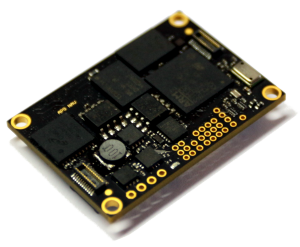

# Navigation Computer

The main board is the heart of the system. It integrates an Inertial Measurement Unit (IMU) and navigation processor.

## Node Features

* Backup battery, RTC for 2 weeks
* FRAM non-volatile high-speed memory
* 12x GPIO ports (3V)
* RS232, RS485, 2xCAN interfaces
* Redundant IMU (Gyro + Accelerometer + Compass + Pressure) MEMS MotionTracking Devices:
  * [MPU-6000](https://www.invensense.com/products/motion-tracking/6-axis/mpu-6050/) Gyroscopes and Accelerometers
  * [HMC5983](http://www51.honeywell.com/aero/common/documents/myaerospacecatalog-documents/Defense_Brochures-documents/HMC5983_3_Axis_Compass_IC.pdf) Magnetic Compass
  * [BMG160](http://www.bosch-sensortec.com/bst/products/all_products/bmg160) Gyroscopes
  * [LSM303D](http://www.st.com/en/mems-and-sensors/lsm303d.html) Accelerometers and Magnetic Compass
  * [MS5611](http://www.amsys.info/products/ms5611.htm) Precision Micro Barometer Module
* Digital Microphone for ambient noise analysis
